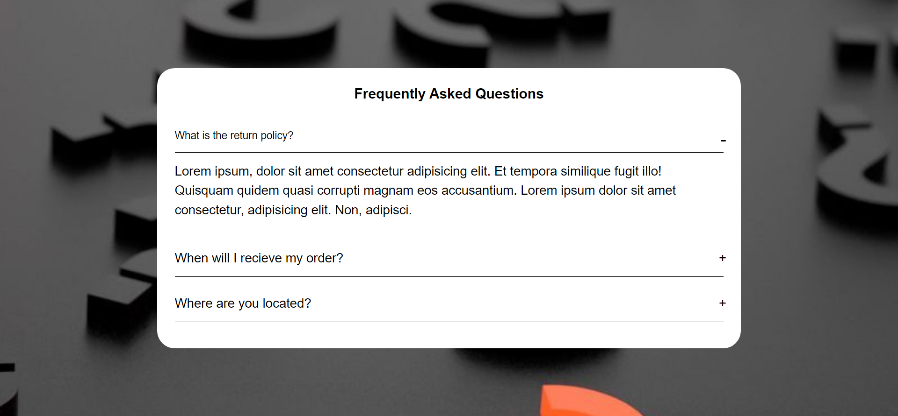

# Random Quotes Generator

## Project Status

<h3> completed</h3>

### The challenge

Users should be able to:

- User can see the frequently asked questions along with the answer.

### Built with

- Semantic HTML5 markup
- CSS
- Javascript

### Links

- Repository URL: [Repositiory Link](https://github.com/svandu/frequent-asked-question)
- Live Site URL: [Live site Link](https://faq-surbhi.netlify.app/)
